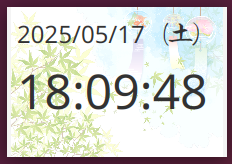

# JavaFX Clock App

A simple always-on-top clock application built with JavaFX.  
It displays the current time (including seconds) and date (with weekday), and allows window dragging without a title bar.



## ✨ Features

- Displays current **time with seconds**
- Shows **date and weekday**
- **Always on top**
- **Frameless** and draggable window
- Right-click menu with **Exit**
- Custom background image support (optional)
- Packaged using **jlink** (custom runtime included)

## 🛠 Requirements

- Java 17+
- JavaFX 21+
- Maven 3.6+
- Module-aware JDK (for `jlink`)

## 📦 Build and Run

To build the project and create a self-contained runtime using `jlink`:

```bash
mvn clean install
mvn jlink:jlink
```

## To run the application:

./target/app-image/bin/clock

## 📁 Project Structure

src/
└── main/
    ├── java/
    │   └── com/example/ClockApp.java
    ├── resources/
    │   └── background.png (optional)
pom.xml

## 🚀 Distribution

The output in target/app-image/ contains the clock binary and all required Java modules.
You can zip and distribute this folder directly. Java installation is not required on the target machine.

## 📝 License

This project is licensed under the MIT License - see the LICENSE file for details.

## 👤 Author

Created by [Toshiaki Shioya @ aioidgt.co.jp]
E-mail t-shioya@aioidgt.co.jp
GitHub: https://github.com/yourusername

