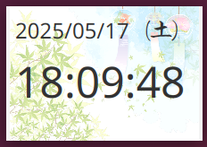

* * *

JavaFX 時計アプリ
============

JavaFX で作られた、常に最前面に表示されるシンプルな時計アプリです。  
現在の時刻（秒単位まで）と日付（曜日付き）を表示し、タイトルバーなしでドラッグ移動が可能です。



✨ 主な機能
------

*   **秒まで表示**される現在時刻
    
*   **日付と曜日**の表示
    
*   **常に手前に表示**
    
*   **フレームなし**で、ドラッグ可能なウィンドウ
    
*   右クリックメニューで **終了**
    
*   時刻＋コメントによる **アラーム機能**
    
*   `hh:mm | コメント`形式のテキストファイルからアラームを読み込み可能
    
*   アラーム予定時刻の **3分前に通知**
    
*   任意の **背景画像**表示に対応（オプション）
    
*   **jlink** を用いたパッケージング（カスタム実行環境同梱）
    

⏰ アラーム機能
--------

**設定ダイアログ**でアラームを管理できます。  
アラームは `hh:mm` の時刻とコメントから構成され、予定時刻の **3分前** に通知されます。

### 📄 アラームファイル形式

「参照」ボタンから `.txt` ファイルを読み込めます。

*   1行につき1つのアラーム
    
*   時刻とコメントの区切りには `|`（半角または全角）を使用
    
*   例:  
    `08:30 | 朝のミーティング`
    

🛠 必要な環境
--------

*   Java 17 以上
    
*   JavaFX 21 以上
    
*   Maven 3.6 以上
    
*   モジュール対応 JDK（`jlink` 用）
    

📦 ビルドと実行方法
-----------

このプロジェクトをビルドし、`jlink` を用いてカスタム実行環境を作成するには：

```bash
mvn clean install
mvn jlink:jlink
```

アプリの実行方法
--------

```bash
./target/app-image/bin/clock
```

📁 プロジェクト構成
-----------

```
src/
└── main/
    ├── java/
    │   └── com/example/ClockApp.java
    ├── resources/
    │   └── background.png（任意）
pom.xml
```

🚀 配布方法
-------

`target/app-image/` に出力されたフォルダには、実行バイナリと必要な Java モジュールがすべて含まれています。  
このフォルダを zip などでまとめて配布できます。配布先には Java のインストールは不要です。

📝 ライセンス
--------

このプロジェクトは MIT ライセンスのもとで公開されています。詳細は `LICENSE` ファイルをご覧ください。

👤 作者
-----

作成者: \[塩谷 敏昭 @ aioidgt.co.jp\]  
Eメール: t-shioya@aioidgt.co.jp  
GitHub: [https://github.com/yourusername](https://github.com/yourusername)

* * *

🛠 JavaFX 実行環境のインストール手順
=======================

このアプリケーションを実行するには、JavaFX を含んだ Java 実行環境が必要です。以下の手順に従って、お使いのOSに適した環境を構築してください。

### 1\. JDK（Java Development Kit）のインストール

JDK 17 以上を [https://adoptium.net/](https://adoptium.net/) などからダウンロード・インストールしてください。

インストール確認：

```bash
java -version
javac -version
```

### 2\. JavaFX SDK のインストール

[https://gluonhq.com/products/javafx/](https://gluonhq.com/products/javafx/) から JavaFX SDK をダウンロードして、任意の場所に展開します。

### 3\. 環境変数の設定（任意ですが推奨）

JavaFX SDK の `lib` パスを環境変数として設定しておくと便利です。

*   **Windows**:
    
    *   環境変数 `PATH_TO_FX` に以下を設定：  
        `C:\javafx-sdk-21\lib`
        
*   **macOS / Linux**:
    
    *   `~/.bashrc` または `~/.zshrc` に追加：
        
        ```sh
        export PATH_TO_FX=/path/to/javafx-sdk-21/lib
        ```
        

### 4\. JavaFX モジュールを指定してアプリケーションを実行

ターミナルから実行する際：

```bash
java --module-path $PATH_TO_FX --add-modules javafx.controls,javafx.graphics -jar your-app.jar
```

> `your-app.jar` の部分は、ご自身のビルドした JAR ファイルに置き換えてください。

### 5\. オプション：Maven を使った実行

Maven を利用している場合、JavaFX の依存関係は自動的に解決されます。アプリを実行するには：

```bash
mvn javafx:run
```

`pom.xml` に JavaFX の依存関係とプラグイン設定が正しく記述されていることを確認してください。

* * *

必要に応じて、この内容を再調整して `README.md` に統合できます。

